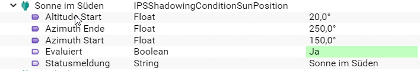

# IPSShadowingConditionSunPosition Modul for IP-Symcon

Das Modul stellt eine Beschattungsbedingung zur Auswertung der Sonnenposition zur Verfügung

### Inhaltverzeichnis

1. [Funktionsumfang](#1-funktionsumfang)
2. [Voraussetzungen](#2-voraussetzungen)
3. [Software-Installation](#3-software-installation)
4. [Einrichten der Instanzen in IP-Symcon](#4-einrichten-der-instanzen-in-ip-symcon)
5. [Statusvariablen und Profile](#5-statusvariablen-und-profile)
6. [PHP-Befehlsreferenz](#6-php-befehlsreferenz)

### 1. Funktionsumfang

* Auswertung einer Bedingung einer Beschattung

### 2. Voraussetzungen

- IP-Symcon ab Version 5.4

### 3. Software-Installation

Die Installation erfolgt über den Module Store.

### 4. Einrichten der Instanzen in IP-Symcon

- Unter "Instanz hinzufügen" kann das 'IPSShadowingConditionSunPosition'-Modul mithilfe des Schnellfilters gefunden werden.
  Weitere Informationen zum Hinzufügen von Instanzen in der [Dokumentation der Instanzen](https://www.symcon.de/service/dokumentation/konzepte/instanzen/#Instanz_hinzufügen)

__Konfigurationsseite__:

Name                          | Beschreibung
----------------------------- | ---------------------------------
Status Meldung evaluiert      | Status Meldung wenn die Bedingung auf TRUE ausgewertet wurde.
Status Meldung nicht evaluiert| Status Meldung wenn die Bedingung auf FALSE ausgewertet wurde.

### 5. Statusvariablen und Profile

Die Statusvariablen/Kategorien werden automatisch angelegt. Das Löschen einzelner kann zu Fehlfunktionen führen.

##### Statusvariablen

Name                          | Beschreibung
----------------------------- | ---------------------------------
Azimuth Start                 | Unteres Limit für den Azimuth Wert.
Azimuth End                   | Oberes Limit für den Azimuth Wert.
Altitude Start                | Unteres Limit für den Altitude Wert.
Evaluated                     | Status der Bedingung, true wenn die Bedingung erfüllt ist.
StatusMessage                 | Statusmeldung der Bedingung

##### Profile:

Name                          | Beschreibung
----------------------------- | ---------------------------------
ShdCond.Evaluated             | Boolean Profil für Variable Evaluated

### 6. PHP-Befehlsreferenz

Name                          | Beschreibung
----------------------------- | ---------------------------------
ShdCond_Evaluate              | Auswertung der Bedingung

Beispiel:
```ShdCond_Evaluate(12345);```

### 7. Beispiele

**Beispiel Temperatur:**

Die Bedingung soll auf TRUE evaluieren wenn die Sonne im Süden steht




