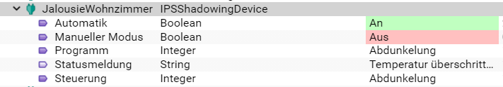

# IPSShadowingDevice Modul for IP-Symcon

Das Modul stellt ein Beschattungsdevice zur Verfügung

### Inhaltverzeichnis

1. [Funktionsumfang](#1-funktionsumfang)
2. [Voraussetzungen](#2-voraussetzungen)
3. [Software-Installation](#3-software-installation)
4. [Einrichten der Instanzen in IP-Symcon](#4-einrichten-der-instanzen-in-ip-symcon)
5. [Statusvariablen und Profile](#5-statusvariablen-und-profile)
6. [PHP-Befehlsreferenz](#6-php-befehlsreferenz)

### 1. Funktionsumfang

* Ansteuerung von Beschattungs Instanzen
* Einbinden von Beschattungs Regeln

### 2. Voraussetzungen

- IP-Symcon ab Version 5.4

### 3. Software-Installation

* Über das Module Control folgende URL hinzufügen:
`https://github.com/brownson/IPSShadowing`

### 4. Einrichten der Instanzen in IP-Symcon

- Unter "Instanz hinzufügen" kann das 'IPSShadowingDevice'-Modul mithilfe des Schnellfilters gefunden werden.
    - Weitere Informationen zum Hinzufügen von Instanzen in der [Dokumentation der Instanzen](https://www.symcon.de/service/dokumentation/konzepte/instanzen/#Instanz_hinzufügen)

__Konfigurationsseite__:

Name                                     | Beschreibung
---------------------------------------- | ---------------------------------
Variable Position                        | Variable für die Ansteuerung der Beschattungsposition
Typ der Bschattung                       | Typ der Beschattung
Fahrzeit Beschattung                     | Fahrzeit der Beschattung von 0 auf 100%
Zeit Hinauffahren für Abdunkelung        | Fahrzeit Hinauf für Abdunkelung von Jalousien ohne Lamellensteuerung
Zeit Hinunterfahren für Abdunkelung      | Fahrzeit Hinunter für Abdunkelung von Jalousien ohne Lamellensteuerung
Beschattungsregeln                       | Liste von Regeln für die Ansteuerung der Beschattung
Timer für Auswertung der Regeln          | Timer in Sekunden für Auswertung der Regeln (0 für die Deaktivierung des Timers)
Zeit für Aktivierung des manuellen Modus | Zeit in Sekunden für Aktivierung des manuellen Modus (0 für Deaktivierung des automatischen Modus, der manuelle Modus wird gesetzt sobald eine Änderung der Position erkannt wird und mindest x Sekunden seit der letzten Ansteuerung durch das Modul vergangen sind)
Regeln Rücksetzen                        | Regeln für das Rücksetzen des manuellen Modus

### 5. Statusvariablen und Profile

Die Statusvariablen/Kategorien werden automatisch angelegt. Das Löschen einzelner kann zu Fehlfunktionen führen.

##### Statusvariablen

Name                          | Beschreibung
----------------------------- | ---------------------------------
Control                       | Steuerelement für Beschattung
Program                       | Aktuelle verwendetes Beschattungsprogramm
ManualMode                    | Schalter/Status für den manuellen Modus
Automatic                     | Schalter für Automatik
StatusMessage                 | Statusmeldung der Bedingung

##### Profile:

Name                          | Beschreibung
----------------------------- | ---------------------------------
ShdDev.ControlBlind           | Steuerelement Jalousien
ShdDev.Program                | Beschattungsprogramm

### 6. PHP-Befehlsreferenz

Name                          | Beschreibung
----------------------------- | ---------------------------------
ShdDev_Move                   | Beschattung ansteuern
ShdDev_Program                | Beschattungsprogramm setzen
ShdDev_Dimout                 | Abdunkelung auslösen
ShdDev_EvluateRules           | Auswertung der Beschattungsregeln

Beispiel:
`ShdDev_Move(12345, 0);

### 7. Beispiele

**Beispiel Jalousie:**

Beispiel einer KNX Beschattung, Fahrzeit beträgt ungefähr 60 Sekunden, die Beschattung kann durch ein kurzes Hoch und wieder Runterfahren verdunkelt werden.

Regeln:
* Bei einer manuellen Ansteuerung soll keine Automatik mehr erfolgen
* Bei Überschreitung der Temperatur soll eine Abdunkelung erfolgen
* Während des Tages soll die Jalousie geöffnet sein oder sich die Lamellen in waagrechter Position befinden (keine Abdunkelung)
* In der Nacht soll eine Abdunkelung erfolgen.

Beispiele für die Konfiguration der Regeln und Bedingungen finden sich bei den entsprechenden Modulen.

Rücksetzen des "Manuellen Modus" erfolgt immer zum Tag/Nacht Wechsel

