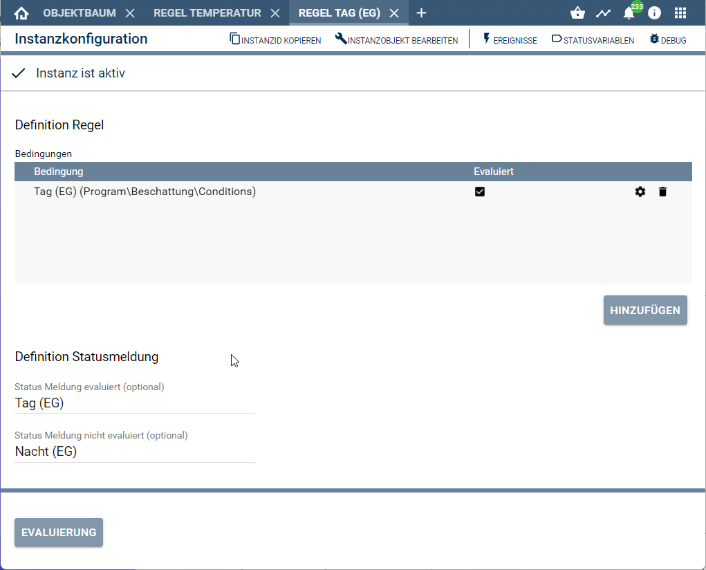
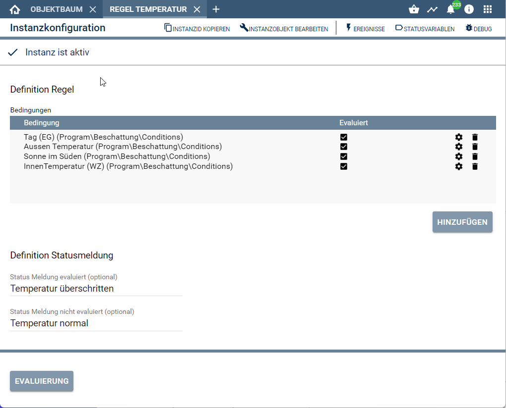

# IPSShadowingRule Modul for IP-Symcon

Das Modul stellt eine Beschattungsregel zur Verfügung

### Inhaltverzeichnis

1. [Funktionsumfang](#1-funktionsumfang)
2. [Voraussetzungen](#2-voraussetzungen)
3. [Software-Installation](#3-software-installation)
4. [Einrichten der Instanzen in IP-Symcon](#4-einrichten-der-instanzen-in-ip-symcon)
5. [Statusvariablen und Profile](#5-statusvariablen-und-profile)
6. [PHP-Befehlsreferenz](#6-php-befehlsreferenz)

### 1. Funktionsumfang

* Einbinden von Beschattungs Bedingungen

### 2. Voraussetzungen

- IP-Symcon ab Version 5.4

### 3. Software-Installation

* Über das Module Control folgende URL hinzufügen:
`https://github.com/brownson/IPSShadowing`

### 4. Einrichten der Instanzen in IP-Symcon

- Unter "Instanz hinzufügen" kann das 'IPSShadowingRule'-Modul mithilfe des Schnellfilters gefunden werden.
    - Weitere Informationen zum Hinzufügen von Instanzen in der [Dokumentation der Instanzen](https://www.symcon.de/service/dokumentation/konzepte/instanzen/#Instanz_hinzufügen)

__Konfigurationsseite__:

Name                           | Beschreibung
------------------------------ | ---------------------------------
Bedingungen                    | Liste von Bedingungen die für die Regel ausgewertet werden sollen
Status Meldung evaluiert       | Status Meldung wenn die Bedingung auf TRUE ausgewertet wurde.
Status Meldung nicht evaluiert | Status Meldung wenn die Bedingung auf FALSE ausgewertet wurde.

### 5. Statusvariablen und Profile

Die Statusvariablen/Kategorien werden automatisch angelegt. Das Löschen einzelner kann zu Fehlfunktionen führen.

##### Statusvariablen

Name                          | Beschreibung
----------------------------- | ---------------------------------
Evaluated                     | Status der Bedingung, true wenn die Bedingung erfüllt ist.
StatusMessage                 | Statusmeldung der Bedingung

##### Profile:

Name                          | Beschreibung
----------------------------- | ---------------------------------
ShdRule.Evaluated             | Boolean Profil für Variable Evaluated

### 6. PHP-Befehlsreferenz

Name                          | Beschreibung
----------------------------- | ---------------------------------
ShdRule_Evaluate              | Beschattung ansteuern

Beispiel:
`ShdRule_Evaluate(12345);

### 7. Beispiele

**Beispiel Tag:**

Die Regel soll während des Tages auf TRUE evaluieren. 

In diesem Beispiel besteht die Regel nur aus einer einfachen Bedingung, als Bedingung kann 
jede "Beschattungs Bedingung" Instanz ausgewählt werden.

**Beispiel Temperatur:**

Die Regel soll auf TRUE evaluieren wenn es Tag ist, die Außen- und Innentemperatur überschritten 
 sind und die Sonne in einem bestimmten Bereich ist.
 

